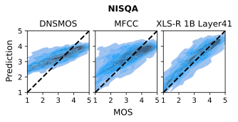
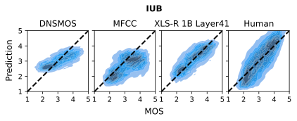

# xls-r-analysis-sqa

## 1. Overview

This repository hosts the models for the paper "Analysis of XLS-R for Speech Quality
Assessment".

### 1.1. Performance On Unseen Datasets

Comparison of model performance on each unseen corpus individually (NISQA, IUB) and
combined together (Unseen). The metric is RMSE, lower is better.

| Model                                  |   NISQA    |    IUB     |   Unseen   |
|----------------------------------------|:----------:|:----------:|:----------:|
| ***XLS-R 300M Layer24 Bi-LSTM [1]***   |  *0.5907*  |  *0.5067*  |  *0.5323*  |
| ***DNSMOS [2]***                       |  *0.8718*  |  *0.5452*  |  *0.6565*  |
| MFCC Transformer                       |   0.8280   |   0.7775   |   0.7924   |
| XLS-R 300M Layer5 Transformer          |   0.6256   |   0.5049   |   0.5425   |
| XLS-R 300M Layer21 Transformer         |   0.5694   |   0.5025   |   0.5227   |
| XLS-R 300M Layer5+21 Transformer       |   0.5683   |   0.4886   |   0.5129   |
| XLS-R 1B Layer10 Transformer           | **0.5456** |   0.5815   |   0.5713   |
| **XLS-R 1B Layer41 Transformer**       |   0.5657   | **0.4656** | **0.4966** |
| XLS-R 1B Layer10+41 Transformer        |   0.5748   |   0.5288   |   0.5425   |
| XLS-R 2B Layer10 Transformer           |   0.6277   |   0.4899   |   0.5334   |
| XLS-R 2B Layer41 Transformer           |   0.5724   |   0.4897   |   0.5150   |
| XLS-R 2B Layer10+41 Transformer        |   0.6036   |   0.4743   |   0.5150   |
| ***Human***                            |  *0.6738*  |  *0.6573*  |  *0.6629*  |

[1] Tamm, B., Balabin, H., Vandenberghe, R., Van hamme, H. (2022) Pre-trained Speech
Representations as Feature Extractors for Speech Quality Assessment in Online
Conferencing Applications. Proc. Interspeech 2022, 4083-4087, doi:
10.21437/Interspeech.2022-10147

[2] C. K. A. Reddy, V. Gopal and R. Cutler, "DNSMOS: A Non-Intrusive Perceptual
Objective Speech Quality Metric to Evaluate Noise Suppressors," ICASSP 2021 - 2021
IEEE International Conference on Acoustics, Speech and Signal Processing (ICASSP),
Toronto, ON, Canada, 2021, pp. 6493-6497, doi: 10.1109/ICASSP39728.2021.9414878.

### 1.2. Visualization of MOS Predictions

MOS predictions on two unseen datasets: NISQA (top) and IU Bloomington (bottom).
Our proposed model based on embeddings extracted from the 41st layer of the
pre-trained XLS-R outperforms DNSMOS and the MFCC baseline. The human ACRs are
also visualized for the IUB corpus.

<p align="left">
  
</p>

<p align="left">
  
</p>

### 1.3. Example Audio Segments

<details>
  <summary>🔊
  
  **Excellent** (MOS = 4.808)
  </summary>
  
  <table>
      <thead>
          <tr>
              <th>Audio Sample</th>
              <th>Model</th>
              <th>Prediction</th>
              <th>Error</th>
          </tr>
      </thead>
      <tbody>
          <tr>
              <td rowspan=3><video src="https://user-images.githubusercontent.com/32679237/235354126-444c44ce-3e39-46da-8b4e-647e64ee243a.mp4"> |</td>
              <td align=center>DNSMOS</td>
              <td align=center>3.699</td>
              <td align=center>-1.109</td>
          </tr>
          <tr>
              <td align=center>MFCC Transformer</td>
              <td align=center>3.231</td>
              <td align=center>-1.577</td>
          </tr>
          <tr>
              <td align=center>XLS-R 1B Layer41 <br /> Transformer</td>
              <td align=center>4.126</td>
              <td align=center>-0.682</td>
          </tr>
      </tbody>
  </table>
  
</details>

<details>
  <summary>🔊
  
  **Good** (MOS = 4.104)
  </summary>

  <table>
      <thead>
          <tr>
              <th>Audio Sample</th>
              <th>Model</th>
              <th>Prediction</th>
              <th>Error</th>
          </tr>
      </thead>
      <tbody>
          <tr>
              <td rowspan=3><video src="https://user-images.githubusercontent.com/32679237/235354278-277152e2-da3e-48aa-b21c-1ddee3e9f0cc.mp4"> |</td>
              <td align=center>DNSMOS</td>
              <td align=center>3.269</td>
              <td align=center>-0.835</td>
          </tr>
          <tr>
              <td align=center>MFCC Transformer</td>
              <td align=center>3.275</td>
              <td align=center>-0.829</td>
          </tr>
          <tr>
              <td align=center>XLS-R 1B Layer41 <br /> Transformer</td>
              <td align=center>3.260</td>
              <td align=center>-0.844</td>
          </tr>
      </tbody>
  </table>

  
  
</details>

<details>
  <summary>🔊
  
  **Fair** (MOS = 3.168)
  </summary>

  <table>
      <thead>
          <tr>
              <th>Audio Sample</th>
              <th>Model</th>
              <th>Prediction</th>
              <th>Error</th>
          </tr>
      </thead>
      <tbody>
          <tr>
              <td rowspan=3><video src="https://user-images.githubusercontent.com/32679237/235358366-df15fb96-7926-4a8e-8d06-cc1833aec3e3.mp4"> |</td>
              <td align=center>DNSMOS</td>
              <td align=center>3.309</td>
              <td align=center>+0.141</td>
          </tr>
          <tr>
              <td align=center>MFCC Transformer</td>
              <td align=center>3.515</td>
              <td align=center>+0.347</td>
          </tr>
          <tr>
              <td align=center>XLS-R 1B Layer41 <br /> Transformer</td>
              <td align=center>3.405</td>
              <td align=center>+0.237</td>
          </tr>
      </tbody>
  </table>

  

</details>

<details>
  <summary>🔊
  
  **Poor** (MOS = 2.240)
  </summary>

  <table>
      <thead>
          <tr>
              <th>Audio Sample</th>
              <th>Model</th>
              <th>Prediction</th>
              <th>Error</th>
          </tr>
      </thead>
      <tbody>
          <tr>
              <td rowspan=3><video src="https://user-images.githubusercontent.com/32679237/235354283-7d765c2f-0e78-48aa-8ac2-26640b09eaf4.mp4"> |</td>
              <td align=center>DNSMOS</td>
              <td align=center>2.704</td>
              <td align=center>+0.464</td>
          </tr>
          <tr>
              <td align=center>MFCC Transformer</td>
              <td align=center>1.535</td>
              <td align=center>-0.705</td>
          </tr>
          <tr>
              <td align=center>XLS-R 1B Layer41 <br /> Transformer</td>
              <td align=center>1.978</td>
              <td align=center>-0.262</td>
          </tr>
      </tbody>
  </table>
  
</details>

<details>
  <summary>🔊
  
  **Bad** (MOS = 1.416)
  </summary>
  
  <table>
      <thead>
          <tr>
              <th>Audio Sample</th>
              <th>Model</th>
              <th>Prediction</th>
              <th>Error</th>
          </tr>
      </thead>
      <tbody>
          <tr>
              <td rowspan=3><video src="https://user-images.githubusercontent.com/32679237/235355743-2ebdb1bf-e9aa-4538-a3fe-acd9633e6443.mp4"> |</td>
              <td align=center>DNSMOS</td>
              <td align=center>2.553</td>
              <td align=center>+1.137</td>
          </tr>
          <tr>
              <td align=center>MFCC Transformer</td>
              <td align=center>1.794</td>
              <td align=center>+0.378</td>
          </tr>
          <tr>
              <td align=center>XLS-R 1B Layer41 <br /> Transformer</td>
              <td align=center>2.029</td>
              <td align=center>+0.613</td>
          </tr>
      </tbody>
  </table>
  
</details>


## 2. Installation

First, clone the repository.

```
git clone https://github.com/lcn-kul/xls-r-analysis-sqa.git
```

Next, install the requirements to a virtual environment of your choice.

```
cd xls-r-analysis-sqa/
pip3 install -r requirements.txt
```

Finally, this code uses truncated XLS-R models. These can be obtained by downloading
them from our HuggingFace repositories
[[link]](/models/xls-r-trunc/README.md) or by downloading the full
pre-trained models [[link]](/models/xls-r/README.md) and running the script
[`truncate_w2v2.py`](/truncate_w2v2.py).

**Warning:** the size of the truncated XLS-R models sums to 15GB (times 2 since the
.git directory is also a similar size).

## 3. Usage

A working example is provided in [test_e2e_sqa.py](/test_e2e_sqa.py).

## 4. Citation

TODO

```bibtex
@inproceedings{X,
  title={X},
  author={X},
  booktitle = {X},
  pages = {X},
  year={2023}
}
```
