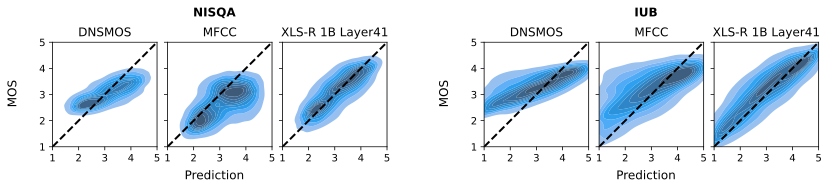

# xls-r-analysis-sqa

## 1. Overview

This repository hosts the models for the paper "Analysis of XLS-R for Speech Quality
Assessment".

### 1.1. Performance On Unseen Datasets

Comparison of model performance on each unseen corpus individually (NISQA, IUB) and
combined together (Unseen). The metric is RMSE, lower is better.

| Model                                  |   NISQA    |    IUB     |   Unseen   |
|----------------------------------------|:----------:|:----------:|:----------:|
| ***XLS-R 300M Layer24 Bi-LSTM [1]***   |  *0.5907*  |  *0.5067*  |  *0.5323*  |
| ***DNSMOS [2]***                       |  *0.8718*  |  *0.5452*  |  *0.6565*  |
| MFCC Transformer                       |   0.8280   |   0.7775   |   0.7924   |
| XLS-R 300M Layer5 Transformer          |   0.6256   |   0.5049   |   0.5425   |
| XLS-R 300M Layer21 Transformer         |   0.5694   |   0.5025   |   0.5227   |
| XLS-R 300M Layer5+21 Transformer       |   0.5683   |   0.4886   |   0.5129   |
| XLS-R 1B Layer10 Transformer           | **0.5456** |   0.5815   |   0.5713   |
| **XLS-R 1B Layer41 Transformer**       |   0.5657   | **0.4656** | **0.4966** |
| XLS-R 1B Layer10+41 Transformer        |   0.5748   |   0.5288   |   0.5425   |
| XLS-R 2B Layer10 Transformer           |   0.6277   |   0.4899   |   0.5334   |
| XLS-R 2B Layer41 Transformer           |   0.5724   |   0.4897   |   0.5150   |
| XLS-R 2B Layer10+41 Transformer        |   0.6036   |   0.4743   |   0.5150   |
| ***Human***                            |  *0.6738*  |  *0.6573*  |  *0.6629*  |

[1] Tamm, B., Balabin, H., Vandenberghe, R., Van hamme, H. (2022) Pre-trained Speech
Representations as Feature Extractors for Speech Quality Assessment in Online
Conferencing Applications. Proc. Interspeech 2022, 4083-4087, doi:
10.21437/Interspeech.2022-10147

[2] C. K. A. Reddy, V. Gopal and R. Cutler, "Dnsmos: A Non-Intrusive Perceptual
Objective Speech Quality Metric to Evaluate Noise Suppressors," ICASSP 2021 - 2021
IEEE International Conference on Acoustics, Speech and Signal Processing (ICASSP),
Toronto, ON, Canada, 2021, pp. 6493-6497, doi: 10.1109/ICASSP39728.2021.9414878.

**Visualization of MOS predictions:**

MOS predictions on two unseen datasets: NISQA (left) and IU
Bloomington (right). Our proposed model based on embeddings extracted from the 41st
layer of the pre-trained XLS-R outperforms DNSMOS and the MFCC baseline.




## 2. Installation

Clone the repository

```
git clone https://github.com/lcn-kul/xls-r-analysis-sqa.git
```

and install the requirements to a virtual environment of your choice.

```
cd xls-r-analysis-sqa/
pip3 install -r requirements.txt
```

## 3. Usage

...
## 4. Citation

TODO

```bibtex
@inproceedings{X,
  title={X},
  author={X},
  booktitle = {X},
  pages = {X},
  year={2023}
}
```